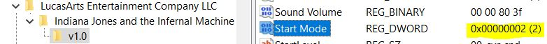

# Prepare the game to accept mods.

Before starting, I suggest that you make a copy of the installed game directory in case you make a mistake in the procedure.

# I. Extract main archives. (.GOB)

1. Download tools at: https://github.com/smlu/ProjectMarduk

2. Extract CD1.gob CD2.gob and JONES3D.gob using gobext.exe

3. You must have different new folders (3do, cog...) in the "Resource" folder.

4. Delete the .GOB files. Then launch your game, if it works you are on the good way. Else retry.

# II. Set the game to start in developer mode.
There are 2 options to run the game in developer mode:

a.) Download and run the [devmode.bat](scripts/devmode.bat) script found in [scripts](scripts) folder.  
*The script requires administration privileges to make changes under `HKEY_LOCAL_MACHINE` - Steam version and original installation.*

b.) Manually change the game config in Windows registry:
  1. On windows search bar, look for "RegEdit.exe" and open it.

  2. Depending on the type of the game install, in the registry editor search for:  
      * Original CD install:  
        `HKEY_LOCAL_MACHINE\Software\LucasArts Entertainment Company LLC\Indiana Jones and the Infernal Machine\v1.0`
        
      * Copy the game files from original CD:  
        `HKEY_LOCAL_MACHINE\Software\LucasArts Entertainment Company LLC\Indiana Jones and the Infernal Machine\v1.0`  
        or  
        `HKEY_CURRENT_USER\SOFTWARE\Classes\VirtualStore\MACHINE\SOFTWARE\WOW6432Node\LucasArts Entertainment Company LLC\Indiana Jones and the Infernal Machine\v1.0`
        
      * GOG version of the game:  
        `HKEY_CURRENT_USER\SOFTWARE\LucasArts Entertainment Company LLC\Indiana Jones and the Infernal Machine\v1.0`
        
      * STEAM version of the game:  
        `HKEY_LOCAL_MACHINE\SOFTWARE\WOW6432Node\LucasArts Entertainment Company LLC\Indiana Jones and the Infernal Machine`

  3. Edit the "`Start Mode`" DWORD and set the value to 2 (*0x00000002*):
    
  *If it doesn't exist create new DWORD with name "`Start Mode`"*.

After the devmode config is set launch the game (e.g.: Indy3D.exe located in "Resource" folder) and the developer window should pop-up: 
 Try to start a random .CND level, if it works you are on the good way. Else retry.

# III. Extract compact level files. (.CND)

5. Extract all game resources from CND files in NDY folder using cndtool.exe

6. In NDY folder, you should have now several folders with the name of levels.

7. For each of them:
    * move the extracted "key" folder to "...\LucasArts\Infernal Machine\Resource\3do\"
    * move the extracted "mat" and "sound" folders to "...\LucasArts\Infernal Machine\Resource\"

9. You can delete the extracted folders in NDY folder, they are now useless.

10. Download "Jones3D_test_level_ORIG.ndy" and "MOD_00_cyn_mod.ndy" found in [resources/ndy](resources/ndy) folder and put them in "...\LucasArts\Infernal Machine\Resource\ndy\"

11. Launch Indy3D.exe and start the two levels: `Jones3D_test_level_ORIG.ndy` and `MOD_00_cyn_mod.ndy`, if it works; congratulations. Else retry.

You should be able to load any original or custom level now.
